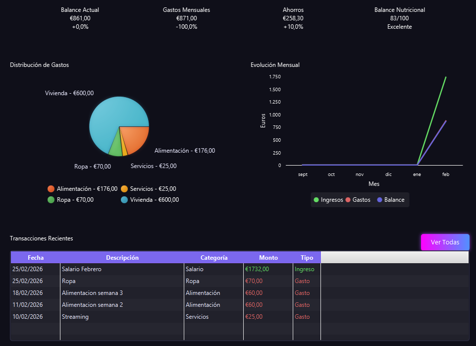

# 🛒 SmartSave - Gestión Inteligente de Finanzas y Compras

    

**SmartSave** es una aplicación de escritorio avanzada diseñada para optimizar el ahorro doméstico. Combina un control exhaustivo de finanzas personales con un motor de búsqueda en tiempo real de productos de supermercado (Mercadona), permitiendo generar listas inteligentes basadas en el presupuesto y el perfil nutricional del usuario.

---

## 📸 Capturas de Pantalla
*(Para que las imágenes se vean, crea una carpeta llamada `screenshots` en tu repositorio, sube tus capturas y asegúrate de que los nombres coincidan con los de abajo)*

| Dashboard Financiero | Generación de Listas |
| :---: | :---: |
|  |  |

---

## ✨ Características Principales

* **Dashboard Dinámico:** Visualización de ingresos, gastos y balances mensuales mediante gráficos interactivos.
* **Microservicio de Scrapeo:** Integración nativa con un servidor Flask y la librería `mercapy` para obtener datos reales de productos en tiempo real.
* **Algoritmos de Ahorro:** Modos de generación de listas: *Ahorro Máximo*, *Equilibrado* y *Nutrición Prioritaria*.
* **Seguridad:** Autenticación robusta con cifrado de contraseñas mediante **JBCrypt**.
* **Portabilidad:** Implementación de base de datos **H2** embebida para ejecución inmediata sin configurar servidores externos.

---

## 🛠️ Desafíos Técnicos y Refactorización

Este proyecto demuestra competencias avanzadas en desarrollo de software:

* **Interoperabilidad Java-Python:** Gestión de subprocesos para ejecutar scripts de scraping y comunicación asíncrona.
* **Automatización de Entorno:** El sistema verifica e instala automáticamente las dependencias de Python (`mercapy`, `requests`) al arrancar, asegurando la operatividad del microservicio en cualquier equipo.
* **Gestión de Concurrencia:** Uso de `CompletableFuture` para realizar peticiones de red sin bloquear la interfaz de usuario (UX).
* **Persistencia Avanzada:** Configuración de **Hibernate 6** con **HikariCP** para una gestión eficiente del pool de conexiones.
* **Robustez:** Implementación de *Shutdown Hooks* para garantizar el cierre limpio de procesos externos y conexiones a la base de datos.

---

## 📂 Estructura del Proyecto

```text
src/main/java/smartsave/
├── api/          # Interoperabilidad Java-Python (Mercadona API)
├── app/          # Ciclo de vida y arranque de la aplicación
├── config/       # Configuración de Hibernate y persistencia H2
├── controlador/  # Controladores MVC de la interfaz JavaFX
├── modelo/       # Entidades JPA (Usuario, Producto, Transacción)
├── servicio/     # Lógica de negocio y gestión de datos
└── utilidad/     # Validaciones, cifrado y gestión de estilos CSS
```
---

## 🚀 Instalación y Ejecución

1. **Clonar el repositorio:** `git clone https://github.com/leonhara/SMARTSAVE.git`
2. **Compilar e instalar dependencias con Maven:** `mvn clean install`
3. **Ejecutar la aplicación:** `mvn javafx:run`

---

## 🛠️ Stack Tecnológico

* **Frontend:** JavaFX 23 (FXML + CSS).
* **Backend:** Java 21 (JDK 21).
* **Persistencia:** Hibernate 6 (JPA) + HikariCP.
* **Base de Datos:** H2 Database Engine.
* **Microservicio:** Python 3.13 + Flask.

---

**Leonel** - Desarrollador de Aplicaciones Multiplataforma  
[LinkedIn](www.linkedin.com/in/leonelyupanquiserrano) | [GitHub](https://github.com/leonhara)